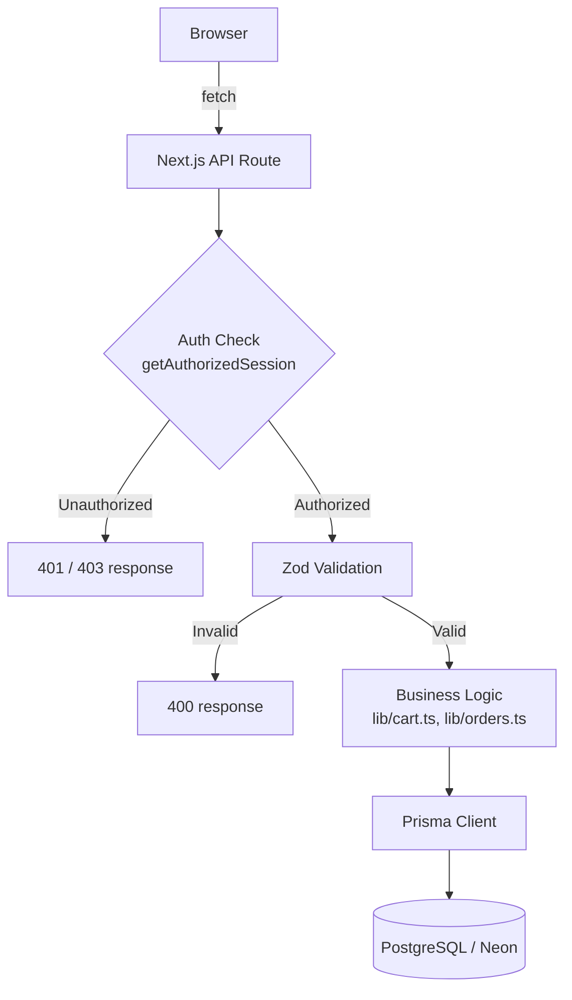
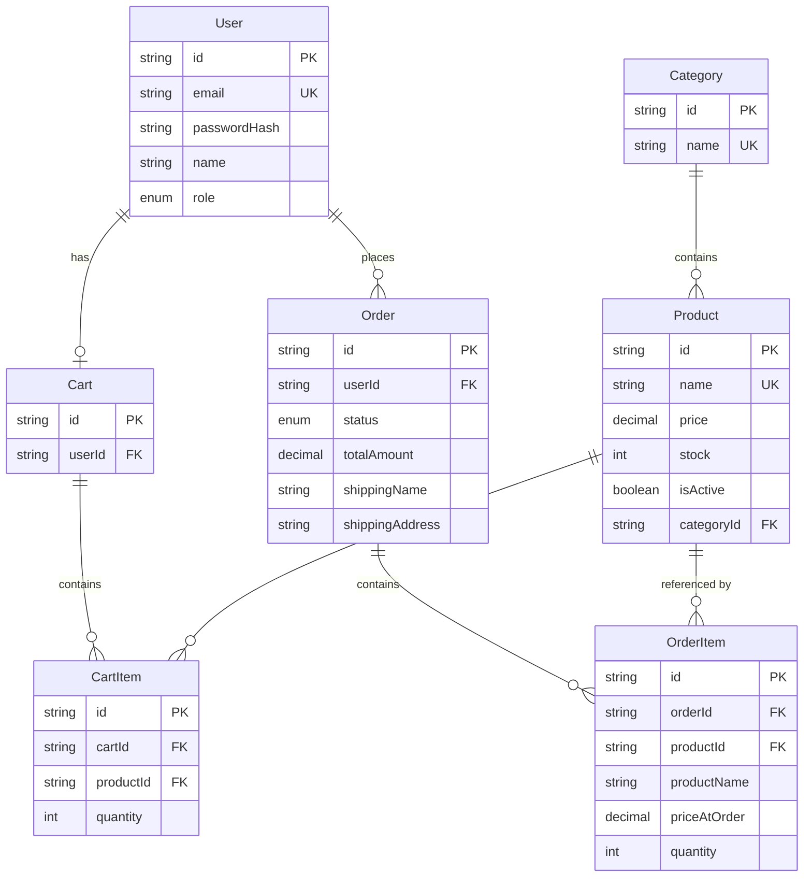

# SANAÉRA — Fashion E-Commerce MVP

A full-stack e-commerce MVP built for the Cruvels Engineering Internship Technical Assignment.

## 1. Project Description

SANAÉRA is a fictional Indian fashion brand. This project implements a complete, working
e-commerce workflow for it: customers can register, browse, search, filter, add products to
a cart, check out with a simulated payment, and track their orders. Admins can manage the
product catalogue, inventory, and order lifecycle through a separate admin dashboard.

## 2. Selected Assignment Option

**Option B — Business-Specific E-Commerce Platform**, built around the fictional brand SANAÉRA.

## 3. Features

**Customer**
- Register / log in / log out (secure, hashed credentials)
- Browse products with search and category filtering
- View product details, stock, and pricing
- Add to cart, update quantities, remove items (server-enforced stock limits)
- Checkout with shipping details and a simulated payment
- View order history and individual order status

**Admin**
- Protected admin dashboard with summary statistics
- Create, edit, and deactivate products; update stock and category
- View all orders across all customers
- Update order status through a validated lifecycle

## 4. Technology Stack

| Layer | Technology |
|---|---|
| Framework | Next.js 16 (App Router) |
| Language | TypeScript |
| Styling | Tailwind CSS |
| Database | PostgreSQL (hosted on Neon) |
| ORM | Prisma 7 |
| Auth | NextAuth v4 (Credentials provider, JWT sessions) |
| Validation | Zod |
| Testing | Vitest |
| Password hashing | bcryptjs |

## 5. Architecture



Every API route follows the same three-step pattern: authenticate/authorize, validate input
with Zod, then delegate to a business-logic function in `lib/`. Business logic never lives
inside route handlers directly — this keeps routes thin and logic independently testable
(see `tests/`).

Admin pages are additionally protected at the layout level (`app/admin/layout.tsx`), which
redirects non-admins server-side before any admin UI renders. This is a UX convenience only —
the actual security boundary is the server-side role check on every API route, since a
customer could otherwise call an admin API directly regardless of what the UI shows them.

## 6. Database Design



**Key decisions:**
- `OrderItem.productName` and `OrderItem.priceAtOrder` are **snapshots** taken at checkout
  time, independent of the live `Product` row. If a product's price or name changes later,
  historical orders remain accurate.
- `Product.isActive` implements "deactivate" as a soft flag rather than deletion, so past
  orders can still reference the product record.
- `Cart` is 1:1 with `User`; a cart is created automatically at registration.
- Stock is decremented atomically (`{ decrement: quantity }`) inside a database transaction
  during checkout, alongside order creation and cart clearing — all three either succeed
  together or none of them take effect.

## 7. Authentication & Authorization

- Passwords are hashed with `bcryptjs` (cost factor 10) — never stored or logged in plain text.
- Sessions use NextAuth's JWT strategy; the JWT and session both carry `id` and `role`.
- Login and registration return the same generic error for "wrong password" and "email
  doesn't exist," preventing account enumeration.
- Every admin-only API route calls `getAuthorizedSession(["ADMIN"])`, returning `403` if the
  caller isn't an admin. This is enforced independently of any frontend UI — see
  `tests/authorize.test.ts` for automated proof, and Section 15 below for a manual
  reproduction.

## 8. API Documentation

### Authentication

| Method | Path | Auth | Role | Body | Success | Errors |
|---|---|---|---|---|---|---|
| POST | `/api/register` | None | — | `{ name, email, password }` | 201, `{ id, name, email }` | 400 invalid input, 409 email exists |
| POST/GET | `/api/auth/[...nextauth]` | — | — | NextAuth-managed | 200 | — |

### Products

| Method | Path | Auth | Role | Body | Success | Errors |
|---|---|---|---|---|---|---|
| GET | `/api/products?search=&category=` | None | — | — | 200, product array | — |
| GET | `/api/products/:id` | None (admin sees inactive) | — | — | 200, product | 404 |
| POST | `/api/products` | Required | ADMIN | `{ name, description, price, imageUrl, stock, categoryId }` | 201, product | 400, 403 |
| PATCH | `/api/products/:id` | Required | ADMIN | Partial product fields | 200, product | 400, 403, 404 |

### Categories

| Method | Path | Auth | Role | Success |
|---|---|---|---|---|
| GET | `/api/categories` | None | — | 200, category array |

### Cart

| Method | Path | Auth | Body | Success | Errors |
|---|---|---|---|---|---|
| GET | `/api/cart` | Required | — | 200, cart with items | 401 |
| POST | `/api/cart` | Required | `{ productId, quantity }` | 201, cart | 400 (stock/inactive), 401, 404 |
| PATCH | `/api/cart/:itemId` | Required | `{ quantity }` | 200, cart | 400, 401, 404 (not owner) |
| DELETE | `/api/cart/:itemId` | Required | — | 200, cart | 401, 404 (not owner) |

### Orders

| Method | Path | Auth | Role | Body | Success | Errors |
|---|---|---|---|---|---|---|
| GET | `/api/orders` | Required | — | — | 200, own orders | 401 |
| POST | `/api/orders` | Required | — | shipping fields | 201, order | 400 (empty cart, out of stock, invalid PIN), 401 |
| GET | `/api/orders/:id` | Required | — | — | 200, order (own, or any if admin) | 401, 404 |
| PATCH | `/api/orders/:id` | Required | ADMIN | `{ status }` | 200, order | 400 (invalid transition), 403, 404 |

### Admin

| Method | Path | Auth | Role | Success |
|---|---|---|---|---|
| GET | `/api/admin/stats` | Required | ADMIN | 200, `{ totalProducts, totalOrders, pendingOrders, totalRevenue }` |

## 9. Environment Variables

See `.env.example`. Required variables:

| Variable | Purpose |
|---|---|
| `DATABASE_URL` | Neon PostgreSQL connection string (pooled) |
| `NEXTAUTH_SECRET` | Secret used to sign session tokens |
| `NEXTAUTH_URL` | Base URL of the app (e.g. `http://localhost:3000`) |

## 10. Database Setup

This project uses [Neon](https://neon.tech) for a free, hosted PostgreSQL database.

1. Create a free Neon project and database.
2. Copy the pooled connection string into `DATABASE_URL` in your `.env`.
3. Run migrations: `npx prisma migrate dev`
4. Seed sample data: `npx prisma db seed`

## 11. Local Setup Instructions

```bash
git clone <repo-url>
cd sanaera
npm install
cp .env.example .env   # then fill in real values
npx prisma migrate dev
npx prisma db seed
```

## 12. How to Run the Application

```bash
npm run dev
```

Visit `http://localhost:3000`.

## 13. How to Run Tests

```bash
npm test
```

Runs the full Vitest suite (17 tests across authentication, cart logic, order logic, and
authorization).

## 14. Demo / Test Credentials

| Role | Email | Password |
|---|---|---|
| Admin | `admin@sanaera.test` | `Admin@123` |
| Customer | `customer@sanaera.test` | `Customer@123` |

These are clearly fake, demo-only credentials, not real secrets.

## 15. Known Limitations

- **Neon connection reliability**: this project uses `@prisma/adapter-neon` (Neon's
  HTTPS/WebSocket-based serverless driver) rather than a raw TCP connection, after
  discovering that some local network environments intermittently block or interrupt raw
  PostgreSQL TCP connections (port 5432). If deployed to a different environment, a standard
  `@prisma/adapter-pg` TCP connection may work reliably; this is left as a configurable choice.
- No real payment gateway is integrated — checkout uses a simulated "Pay ₹X" button per the
  assignment's explicit requirement.
- PIN code validation checks for a 6-digit format only, not an actual valid Indian postal code.
- No pagination on product or order lists — acceptable at this MVP's data scale, but would be
  needed at production scale.
- Category management (creating new categories via the UI) is not implemented; categories are
  seeded directly. The database and API (`GET /api/categories`) fully support it, but no
  admin UI form was built for creating new categories, since the assignment scope prioritizes
  the core workflow over this secondary feature.

## 16. Future Improvements

- Product image upload instead of external image URLs
- Pagination and sorting on product/order lists
- Email notifications on order status changes
- Admin UI for creating and editing categories
- Wishlist / saved items
- Product reviews and ratings

---

## Sample Products

Ajrakh Silk Saree, Mirror Work Saree, Handloom Cotton Saree, Embroidered Kurta, Silk Anarkali,
Festive Dupatta — all seeded with dummy prices and placeholder images (`placehold.co`), no
real product data.